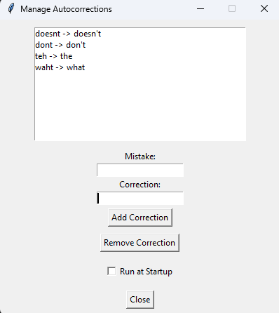

# Autocorrect Tool

Autocorrect Tool is a lightweight application that automatically corrects predefined typos as you type. It allows users to manage custom corrections and run the application in the background using a system tray icon similar to the phone Autocorrect.

 

---
## Note
- This is my first ever fully completed python project :)
## Caution
if your using the v1.0.0
- You must go to the .exe of the autocorrect tool and in the properties and enable Run this program as adminstrator becauase if not it wont save the correction to the correction.json file
---

## Features
- Automatically correct typos in real-time.
- Add, remove, and manage custom corrections.
- Runs as a system tray application for minimal interference.
- Enable or disable startup functionality via the app.

---

## Getting Started

### Installation
1. Download the installer from the [Releases](https://github.com/MezoDawnHorizon/Autocorrect-Tool/releases) page.
2. Run the installer and follow the instructions.

### Usage
1. Launch the application after installation.
2. Use the system tray icon to manage settings:
   - Add or remove autocorrections.
   - Enable/disable startup.

### Requirements
- Windows OS
- latest version of Python (for development)
